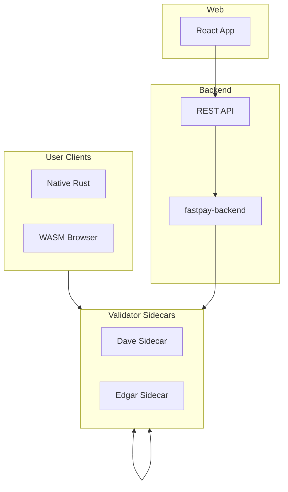
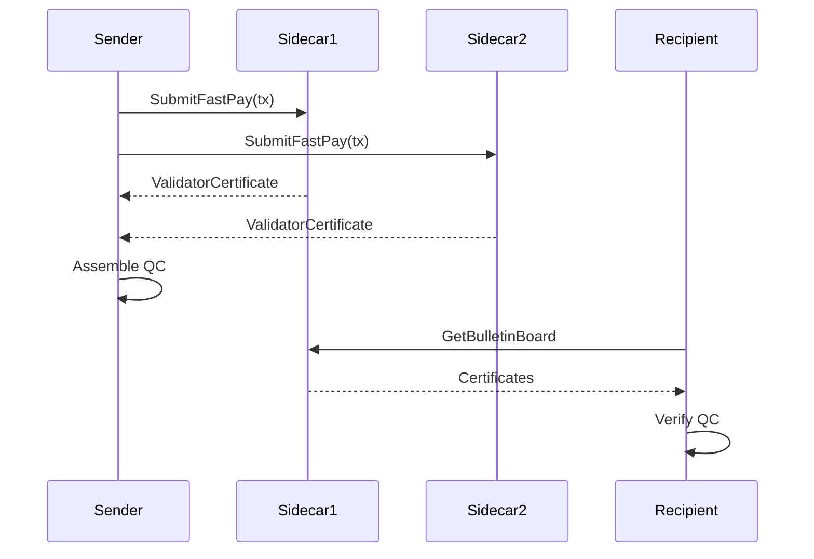

# System Architecture

FastPay is a preconfirmation payment system for the Tempo blockchain. Users complete chained payments before block finalization using validator-signed certificates that aggregate into Quorum Certificates.

## Overview

The system consists of four main component layers. User clients construct and submit transactions to validator sidecars. Sidecars validate transactions and issue certificates. The aggregator backend collects certificates from multiple sidecars and assembles Quorum Certificates. The web frontend provides a browser interface for payments.

This diagram shows the primary data flows between components. User clients submit transactions directly to validator sidecars. Sidecars gossip certificates among themselves. The backend fans out requests to all sidecars and aggregates responses. The web frontend communicates with the backend through REST endpoints.

## Payment Flow

A payment progresses through several stages from submission to finality. The sender constructs a `FastPayTx` containing the payment details, nonce, and expiry. Validator sidecars validate the transaction and return signed certificates. Once enough certificates are collected, they form a Quorum Certificate.

The QC threshold determines how many validator certificates are required. In the demo with two validators, the threshold is 2 of 2. In production deployments, the threshold follows Byzantine fault tolerance requirements at 2f+1 where f is the maximum number of faulty validators tolerated.

This sequence shows the happy path for a single payment. The sender submits to multiple sidecars in parallel. Each sidecar validates and returns a certificate. The sender assembles the Quorum Certificate locally. The recipient can discover the payment through the bulletin board.

## Chained Payments

Recipients can spend received funds before block settlement using parent QC references. Bob receives a payment from Alice and obtains the QC. Bob includes the QC hash as `parent_qc_hash` in a new payment to Carol. Sidecars validate the parent QC and credit Bob with the incoming amount.

This enables instant chained payments without waiting for on-chain confirmation. The contention key `(sender, nonce_key, nonce_seq)` prevents double-spending at the FastPay layer.

## Crate Structure

| Crate | Purpose |
|-------|---------|
| `fastpay-types` | Core traits and ID types |
| `fastpay-crypto` | Ed25519 signatures and canonical hashing |
| `fastpay-proto` | Generated protobuf types and gRPC stubs |
| `fastpay-user-client` | Wallet, transaction builder, certificate manager |
| `fastpay-sidecar` | Validator gRPC service |
| `fastpay-sidecar-mock` | In-memory mock for testing |
| `fastpay-backend` | Aggregator with REST API |
| `demo` | End-to-end demo binary |

The crates form a layered dependency structure. `fastpay-types` sits at the bottom with no internal dependencies. `fastpay-crypto` implements the traits from `fastpay-types`. `fastpay-proto` generates wire types from protobuf definitions. Higher-level crates depend on these foundations.

## Related Documentation

See [Validator Sidecar](04-sidecar.md) for the gRPC service implementation.

See [Aggregator Backend](03-backend.md) for the REST API and certificate aggregation.

See [User Client](02-user-client.md) for the Rust client library.

See [Tempo Integration](05-tempo-integration.md) for blockchain-specific details.

See [Demo Scenario](06-demo.md) for the end-to-end demonstration.
