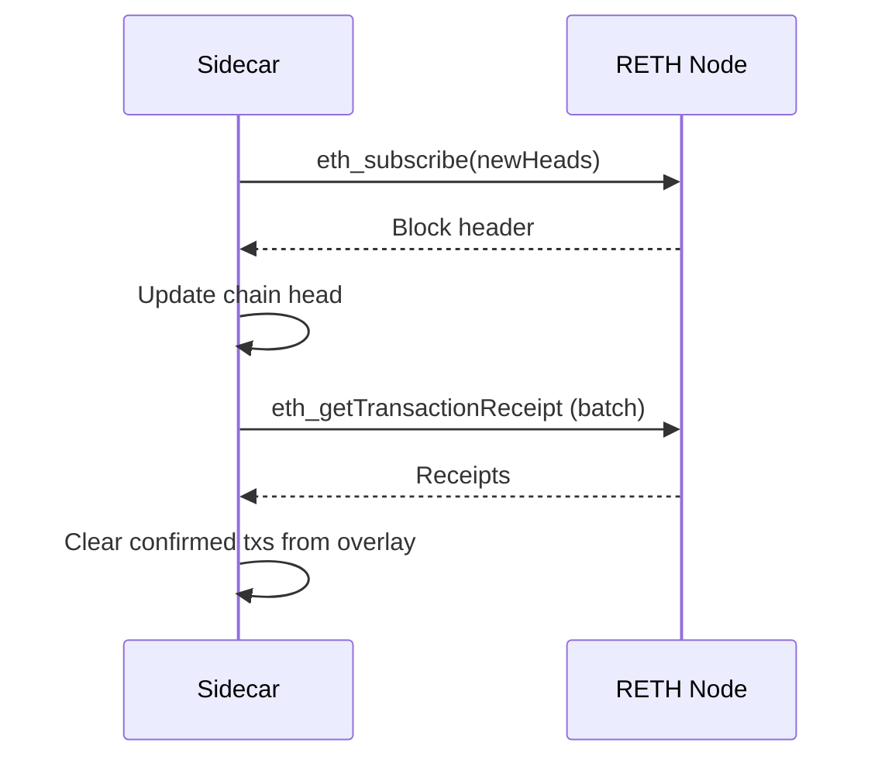

# Validator Sidecar

The validator sidecar is a gRPC service that manages Allegro certificates for a single validator. It validates incoming transactions, issues signed certificates, and maintains a bulletin board for certificate discovery.

## Purpose

Each validator runs a sidecar alongside their Tempo node. The sidecar receives payment transactions from user clients. It validates each transaction against local state and signs a certificate if valid. Certificates are stored locally and gossiped to peer sidecars.

The sidecar enforces the contention model that prevents double-spending. A validator signs at most one certificate per contention key. The contention key is the tuple `(sender, nonce_key, nonce_seq)`.

## gRPC API

The sidecar implements the `FastPaySidecar` service defined in `proto/sidecar.proto`.

### SubmitFastPay

```protobuf
rpc SubmitFastPay(SubmitFastPayRequest) returns (SubmitFastPayResponse);
```

Validates a `FastPayTx` and returns a `ValidatorCertificate` on success. The request includes the transaction and any parent QCs for chained payments. The response contains either a certificate or a rejection with error code.

### SubmitFastPayStream

```protobuf
rpc SubmitFastPayStream(stream SubmitFastPayRequest) returns (stream SubmitFastPayEvent);
```

Bidirectional streaming variant of SubmitFastPay. The client sends transaction requests and receives lifecycle events. Each event includes the current `block_height` for expiry tracking.

| Event Type | Description |
|------------|-------------|
| ACCEPTED | Transaction passed initial validation |
| Certificate | Validator certificate issued |
| CERTIFIED | QC threshold reached (if applicable) |

Streaming reduces round-trips for clients submitting multiple transactions.

### GetBulletinBoard

```protobuf
rpc GetBulletinBoard(GetBulletinBoardRequest) returns (GetBulletinBoardResponse);
```

Returns stored certificates matching the filter criteria. Clients can filter by `tx_hash`, `address`, or `since_unix_millis` for incremental sync. The response includes certificates from this validator and any gossiped certificates from peers.

### GetValidatorInfo

```protobuf
rpc GetValidatorInfo(GetValidatorInfoRequest) returns (GetValidatorInfoResponse);
```

Returns the validator identity including name, public key, and gossip peer list. Clients use this to build the committee verification context.

### GetChainHead

```protobuf
rpc GetChainHead(GetChainHeadRequest) returns (GetChainHeadResponse);
```

Returns the current chain state including block height, block hash, and timestamp. Clients use this to check expiry conditions and reconcile pending transactions.

## State Management

The sidecar maintains several data structures for validation and storage.

### Balances and Overlay

Base balances are seeded from chain state or configuration. The overlay tracks pending debits from in-flight transactions. Available balance is computed as base balance plus overlay adjustments.

```rust
available = base_balance + overlay_delta
```

The overlay becomes negative as the sender submits payments. Parent QC credits are computed by extracting the `EffectsSummary` from the parent certificate.

### Equivocation Guard

The `signed_txs` map prevents signing conflicting transactions. Each entry maps a contention key to the `tx_hash` that was signed. If a new transaction arrives with the same contention key but different hash, validation fails.

### Certificate Store

Certificates are stored by `tx_hash`. Each transaction may have certificates from multiple validators due to gossip. The store deduplicates by signer ID to prevent double-counting.

### Nonce Sequences

The `nonce_sequences` map tracks the next expected nonce for each `(sender, nonce_key)` pair. Transactions must use exactly the next sequence number. Gaps and out-of-order submissions are rejected.

### Request Idempotency

The sidecar caches responses by `client_request_id` to support idempotent retries. If a client resubmits a request with the same ID, the cached response is returned without re-validation. The cache uses LRU eviction when `max_request_cache` is exceeded.

## Safety Limits

The sidecar enforces memory bounds to prevent resource exhaustion.

| Limit | Default | Purpose |
|-------|---------|---------|
| `max_total_certs` | 10,000 | Certificate store capacity |
| `max_known_qcs` | 4,096 | QC cache capacity |
| `max_request_cache` | 8,192 | Idempotency cache size |
| `max_bulletin_board_response` | 1,000 | Max certificates per query |
| `max_pending_evm_txs` | 4,096 | RETH forwarding queue |

When limits are exceeded, the oldest entries are evicted using LRU ordering.

## Validation Flow

Transaction validation proceeds through several checks.

1. Decode the `tempo_tx` bytes and recover the sender from the signature
2. Validate the overlay payment metadata matches the decoded transaction
3. Check expiry against current chain head
4. Check the contention key has not been signed for a different transaction
5. Validate nonce sequence is exactly the expected next value
6. Compute available balance including parent QC credits
7. Verify balance covers the payment amount

If all checks pass, the sidecar signs a certificate.

### Certificate Message Format

The validator signs a typed message binding the certificate to the transaction and its effects.

```
preimage = CERT_PREIMAGE_TAG || domain_tag || protocol_version || chain_id || epoch || tx_hash || effects_hash
cert_message = sha256(preimage)
```

The `CERT_PREIMAGE_TAG` is the string `"tempo.fastpay.cert.preimage.v1"`. The `domain_tag` identifies the FastPay protocol version. The `chain_id` and `epoch` prevent cross-chain and cross-epoch replay.

The sender, nonce_key, nonce_seq, and expiry are committed indirectly through the `tx_hash` and `effects_hash` computations rather than directly in the certificate preimage.

The certificate includes the `tx_hash`, `effects_hash`, validator identity, and Ed25519 signature over the cert message.

## Replay Protection

The certificate preimage includes `chain_id` and `epoch` to prevent replay attacks. The `chain_id` ensures certificates cannot be replayed across different networks. The `epoch` binds certificates to a specific validator set.

The `expiry` field in the transaction prevents indefinite replay. Sidecars reject transactions with expired timestamps or block heights. This bounds the window during which a certificate remains valid.

## Gossip Protocol

Sidecars synchronize certificates through pull-based gossip. Each sidecar periodically calls `GetBulletinBoard` on its configured peers. The `since_unix_millis` parameter enables incremental sync.

```rust
loop {
    for peer in peers {
        let certs = peer.get_bulletin_board(since_last_sync);
        ingest_peer_certs(certs);
    }
    sleep(gossip_interval);
}
```

Ingested certificates are validated and deduplicated by signer. The gossip interval and peer list are configurable at startup.

## RETH Node Integration

The sidecar optionally connects to a RETH node via WebSocket for chain state and transaction forwarding. This feature is enabled by providing `--reth-ws-url` at startup.

### Block Subscription

The sidecar subscribes to new block headers through the WebSocket connection. Each block updates the local chain head for expiry checking. Confirmed transactions are cleared from the overlay to free balance for new payments.



### Transaction Forwarding

After issuing a certificate, the sidecar forwards the signed EVM transaction to the RETH mempool. This enables validators to include certified transactions in blocks.

```rust
// Forwarding occurs after successful certification
reth.send_raw_transaction(raw_evm_tx).await?;
```

The forwarding queue has bounded capacity. If RETH is unavailable, transactions accumulate until the queue limit is reached.

### Reconnection

Both the block subscription and transaction submission tasks implement exponential backoff reconnection. The base delay is 500ms with a maximum of 30 seconds. Each task reconnects independently to maximize availability.

## Configuration

The sidecar binary accepts configuration through command-line arguments or environment variables.

| Option | Description |
|--------|-------------|
| `--grpc-addr` | Listen address for gRPC server |
| `--validator-key` | Path to Ed25519 private key |
| `--chain-id` | Tempo chain identifier |
| `--epoch` | Current validator epoch |
| `--peers` | Comma-separated list of peer sidecar endpoints |
| `--gossip-interval` | Interval between gossip pulls |
| `--reth-ws-url` | Optional RETH WebSocket endpoint for chain integration |
| `--max-pending-txs` | RETH forwarding queue capacity (default 4096) |

## Related Documentation

See [System Architecture](01-architecture.md) for the overall system design.

See [Aggregator Backend](03-backend.md) for the service that aggregates across sidecars.

See [Tempo Integration](05-tempo-integration.md) for how sidecars interact with Tempo nodes.
