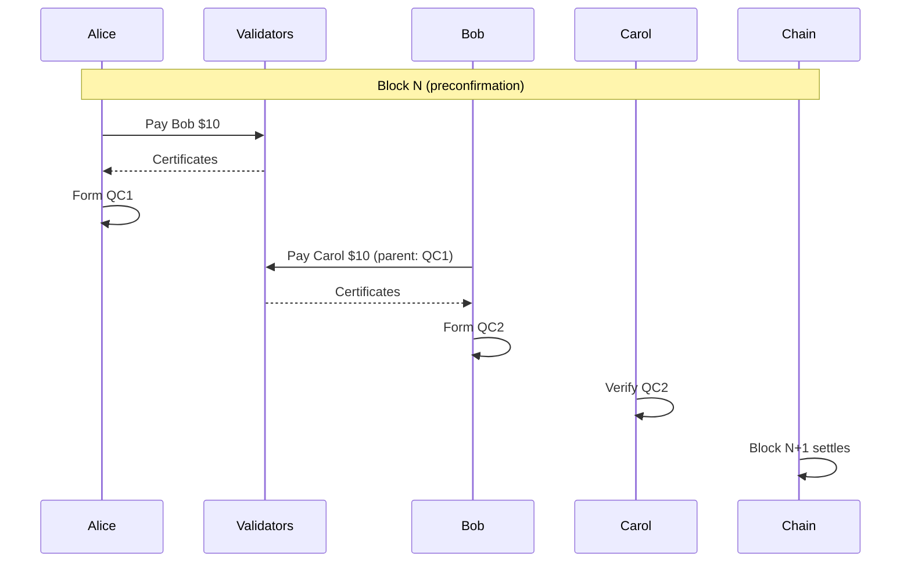
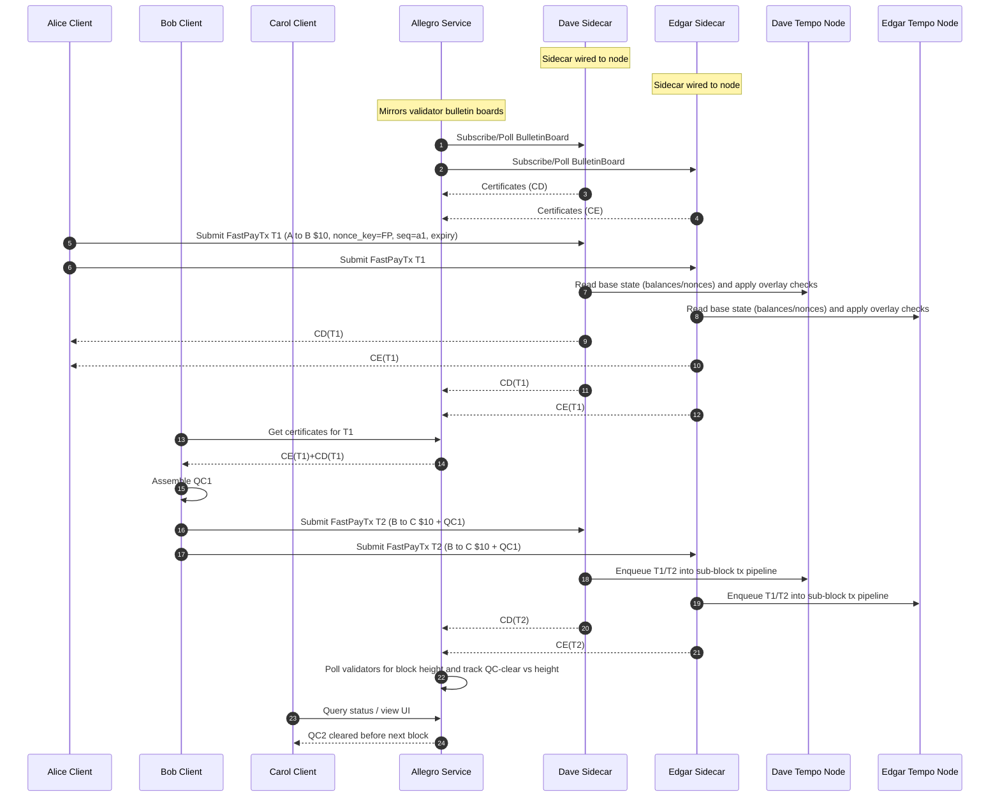

# Demo Scenario

This document describes the Allegro demonstration scenario showing chained payments completing before block finalization.

## Overview

The demo involves five actors completing two chained payments within a single block interval. Alice pays Bob, then Bob immediately spends those funds to pay Carol. Both payments achieve QC-cleared status before the next block height advances.



Both payments complete with QC confirmation before the block height advances, demonstrating the preconfirmation property.

## Actors

Three user clients participate in the payment flow.

| Actor | Starting Balance | Role |
|-------|------------------|------|
| Alice | $15 | Initiates first payment |
| Bob | $5 | Receives from Alice, pays Carol |
| Carol | $5 | Receives final payment |

Two validators run Allegro sidecars.

| Validator | Role |
|-----------|------|
| Dave | Issues certificates, runs sidecar |
| Edgar | Issues certificates, runs sidecar |

The Allegro service aggregates certificates and provides the web UI.

## Payment Flow

The demo executes two payments in sequence.

1. Alice pays Bob 10 USD
2. Bob pays Carol 10 USD using the QC from payment 1 as parent

After both payments complete, the balances are Alice 5 USD, Bob 5 USD, Carol 15 USD. Bob's balance remains 5 USD because he received 10 USD and immediately spent 10 USD.

## Demo Configuration

The Tempo chain runs with a 5-second block time for visual clarity. This provides enough time to observe QC formation before block inclusion.

```toml
[chain]
block_time_seconds = 5
```

The demo uses a 2-of-2 threshold. Both Dave and Edgar must sign for a QC to form.

## Detailed Information Flow

This diagram shows the complete flow with sidecars wired to Tempo nodes and the Allegro service aggregating certificates.



The key observation is that Carol sees the QC-cleared payment before the block height increments. This demonstrates the preconfirmation property.

## Verification Steps

The demo UI displays the following to verify correct operation.

1. Current block height from chain polling
2. List of Allegro transactions with their stage (ACCEPTED, CERTIFIED, INCLUDED)
3. Timestamp showing QC formation occurred before block height change

The successful demo shows both T1 and T2 reach CERTIFIED stage while the block height remains constant.

## Related Documentation

See [System Architecture](01-architecture.md) for the overall system design.

See [Aggregator Backend](03-backend.md) for the Allegro service implementation.

See [Tempo Integration](05-tempo-integration.md) for sub-block transaction routing.
