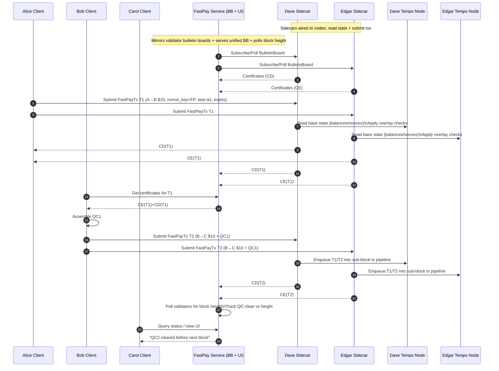

# FastPay for Tempo Architecture

## 1) What we're trying to achieve

Build a **FastPay-style "preconfirm then relay" payment path** for the Tempo blockchain (Tempo = reth + commonware) that lets users complete **two chained payments** (Alice→Bob, then Bob→Carol) **before the next block height advances**, while still being compatible with Tempo's existing transaction and blockspace model.

**Core idea:** validators (via sidecars) issue **signed validator certificates** over a payment transaction; a recipient aggregates enough certificates into a **Quorum Certificate (QC)** and can immediately use that QC to authorize a subsequent FastPay spend—without waiting for block finalization.

---

## 2) Reference material (Tempo-native primitives we're building on)

**Tempo transactions & nonces**

* Tempo uses **2D nonces**: `nonces: mapping(uint256 => uint64)` stored in a dedicated precompile. ([docs.tempo.xyz][1])
* Tempo defines **reserved sequence keys**: nonce sequence keys whose MSB is `0x5b` are reserved for **sub-block transactions**. ([docs.tempo.xyz][1])

**Tempo blockspace structure**

* Tempo blocks are ordered into sections, including **sub-block transactions**, "grouped by proposer and prefixed with the reserved nonce key." ([docs.tempo.xyz][2])

**Payment transaction classification**

* Tempo defines payment transactions purely by payload: `tx.to` has TIP-20 payment prefix, or all TempoTransaction calls target TIP-20 payment-prefixed addresses. ([docs.tempo.xyz][3])

**Nonce key usage guidance & economics**

* Docs recommend **reusing a small set of nonce keys** rather than random keys, because **creating a new nonce key incurs state creation costs (TIP-1000)**. ([docs.tempo.xyz][4])
* Accessing an existing 2D nonce key costs **5,000 gas** (TIP-1000 related). ([GitHub][5])
* This strongly favors key reuse over per-transaction key generation.

**Repo workspace and sidecar template**

* The workspace includes `bin/tempo-sidecar`, which serves as the structural template for the validator sidecar binary. ([GitHub][6])

---

## 3) System overview

### Actors

**User clients (Rust native + WASM)**

* Alice: starts with $15; pays Bob $10
* Bob: starts with $5; receives $10 then pays Carol $10
* Carol: starts with $5; receives $10

**Validators**

* Dave, Edgar (each runs a validator node in Phase 2, plus a FastPay sidecar)

**FastPay service (Phase 2)**

* Third-party backend + frontend that mirrors validator bulletin boards and provides a unified bulletin board + UI.

### Key artifacts

* **FastPayTx**: payment transaction (TempoTransaction / EVM tx) + FastPay metadata (nonce key/seq, expiry).
* **ValidatorCertificate**: validator signature attesting to `(tx_hash, effects_hash, domain, signer)`.
* **QuorumCertificate (QC)**: threshold bundle of validator certificates for the same `(tx_hash, effects_hash)`.

---

## 4) Protocol objects (spec)

### 4.1 FastPayTx (logical payload)

Must include:

* `chain_id`
* `tx` (TempoTransaction or EVM tx), restricted to **TIP-20 payment transactions** to match Tempo's payment classification and keep the system simple ([docs.tempo.xyz][3])
* `nonce_key`: a dedicated FastPay nonce key in the reserved `0x5b…` namespace, aligning with Tempo's sub-block transaction handling ([docs.tempo.xyz][1])
* `nonce_seq`: monotonic per `(sender, nonce_key)` using Tempo's 2D nonce model ([docs.tempo.xyz][1])
* `expiry`: e.g., `(validBefore)` timestamp or `(max_block_height)` (prevents indefinite replay)
* optional: `parent_qc` (for chained spending; required for Bob→Carol in the demo)

### 4.2 ValidatorCertificate

A validator signs a typed message:

**Cert message = hash(domain || tx_hash || effects_hash || sender || nonce_key || nonce_seq || expiry)**

Where:

* `domain` binds the signature to FastPay + chain_id
* `effects_hash` commits to the state transition the sidecar claims

### 4.3 QuorumCertificate (QC)

* A set of `ValidatorCertificate`s for the same `tx_hash` and `effects_hash`
* Threshold: in demo with 2 validators, QC = {Dave, Edgar}
* In real deployment: QC = threshold (e.g., 2f+1) (out of scope for hackathon math, but the data structure should support it)

---

## 5) Component architecture

### 5.1 User Client (Phase 1 + Phase 2)

Responsibilities:

* Construct FastPayTx with correct `(nonce_key, nonce_seq)`
* **Reuse a fixed (or small set of) FastPay nonce key(s)**—do not generate random keys per payment due to TIP-1000 state creation costs ([docs.tempo.xyz][4])
* Submit to validator sidecars (gRPC)
* Track local bookkeeping:

  * pending outgoing txs
  * received certs
  * assembled QCs
  * "available balance" under FastPay overlay
* For chained spend: attach `parent_qc` to next tx submission

Client must verify:

* validator signatures
* that certificates match tx/effects hashes
* QC threshold

### 5.2 Validator Sidecar (Phase 1)

Built using `bin/tempo-sidecar` as the scaffold. ([GitHub][6])

Responsibilities:

* Provide **FastPay mempool** separate from L1
* Validate a submitted FastPayTx against sidecar state
* If valid: sign certificate, store it, gossip it to other validators
* Maintain bulletin board query interface

**Contention model:** Because Tempo is account-based, the **contention key = (sender, nonce_key, nonce_seq)**. A sidecar considers a tx non-contending if:

* no other FastPay tx exists for the same `(sender, nonce_key, nonce_seq)`, and
* the validator has not already signed a different tx for that same key

Sidecar bookkeeping (Phase 1 demo state):

* `base_balances[address]` (seeded for Alice/Bob/Carol)
* `fastpay_overlay[address]`:

  * debits/credits from certified FastPay txs not yet finalized onchain
* `signed_by_me[(sender, nonce_key, nonce_seq)] = tx_hash` (equivocation guard)
* `cert_store[tx_hash] = Vec<certs>` (for bulletin board)

### 5.3 Validator Sidecar (Phase 2)

Adds:

* Read account state from Tempo node (base balances / TIP-20 balances)
* Submit cleared FastPayTxs into the node's **sub-block transaction lane**, so they appear before/within the next block interval consistent with Tempo's block format ([docs.tempo.xyz][2])
* Track "clearing": when a FastPayTx appears in chain / reaches desired confirmation, remove it from overlay

### 5.4 Third-party FastPay Service (Phase 2)

Backend responsibilities:

* Connect to validator bulletin boards
* Mirror/cache certificates
* Expose its own bulletin board endpoint for clients
* Provide an API for "clearing status" and recent FastPay tx timeline

Frontend responsibilities:

* Simple UI:

  * current block height polling
  * list of FastPay txs and whether they're QC-cleared
  * show that QC-clearing occurs before block height changes

---

## 6) Phase 1 — End-to-end demo (no node wiring)

### Goal

Achieve a complete e2e flow involving all five actors:

* Alice submits Alice→Bob and receives validator certs (preconfirm)
* Bob fetches certs from bulletin board, assembles QC(Alice→Bob)
* Bob submits Bob→Carol including QC(Alice→Bob)
* Carol can observe Bob→Carol has QC cleared

### Phase 1 information flow (Mermaid)

```mermaid
sequenceDiagram
  autonumber
  participant A as Alice Client
  participant B as Bob Client
  participant C as Carol Client
  participant D as Dave Sidecar
  participant E as Edgar Sidecar

  Note over A,B,C: Clients (Rust native + WASM)
  Note over D,E: Validator sidecars (FastPay mempool + signing + bulletin board)

  A->>D: Submit FastPayTx T1 (A→B $10, nonce_key=FP, seq=a1, expiry)
  A->>E: Submit FastPayTx T1 (same payload)

  D->>D: Validate + lock (A,FP,a1)\nUpdate overlay\nSign cert CD(T1)
  E->>E: Validate + lock (A,FP,a1)\nUpdate overlay\nSign cert CE(T1)

  D-->>A: Callback: ValidatorCertificate CD(T1)
  E-->>A: Callback: ValidatorCertificate CE(T1)

  D-->>E: Gossip CD(T1)
  E-->>D: Gossip CE(T1)

  B->>E: BulletinBoard: Get certs for T1 / or all certs
  E-->>B: Return CE(T1) + CD(T1)

  B->>B: Verify signatures\nAssemble QC1 = {CD, CE}

  B->>D: Submit FastPayTx T2 (B→C $10, nonce_key=FP, seq=b1, expiry, parent=QC1)
  B->>E: Submit FastPayTx T2 (same)

  D->>D: Validate QC1 & balances\nLock (B,FP,b1)\nSign cert CD(T2)
  E->>E: Validate QC1 & balances\nLock (B,FP,b1)\nSign cert CE(T2)

  D-->>B: Callback: CD(T2)
  E-->>B: Callback: CE(T2)

  B->>B: Assemble QC2 = {CD, CE}
  C->>E: BulletinBoard: Get certs for T2
  E-->>C: Return CE(T2) + CD(T2)
  C->>C: Verify + display "Received QC-cleared payment"
```

### Phase 1 APIs (spec)

**Sidecar gRPC**

1. `SubmitFastPay(tx: FastPayTx, parent_qcs: Vec<QC>) -> stream ValidatorCertificate`

   * returns the signing sidecar's certificate (or rejection with reason)
2. `GetBulletinBoard(filter) -> BulletinBoardResponse`

   * Phase 1 minimal: return **ALL** certificates
   * Optional filters: by `tx_hash`, by `address`, by `time_range`

**Client**

* Must implement signature verification and QC assembly logic
* Maintains per-address `next_seq` for the FastPay nonce key

---

## 7) Phase 2 — Wiring into Tempo + adding FastPay Service

### Goals

1. **Wire validator sidecar to a real Tempo node**

   * sidecar reads account state from node (no more fake balances)
   * sidecar forwards FastPayTxs into a dedicated path that ends up in **sub-block transactions** ([docs.tempo.xyz][2])

2. **Add third-party FastPay service**

   * service ingests validator bulletin boards and provides a unified bulletin board for clients
   * UI demonstrates: FastPay QC-clears **before block height increments**
   * Set chain block time to **5 seconds** for visual clarity (demo configuration)

### Phase 2 information flow (Mermaid)



### Phase 2 integration points (spec)

**Sidecar ↔ Node**

* Read base account state needed for checks:

  * TIP-20 balances (for the configured stablecoin)
  * current 2D nonce for `(sender, nonce_key)` via the nonce precompile model ([docs.tempo.xyz][1])
* Submit FastPayTx into:

  * a dedicated lane / mechanism that feeds **sub-block transactions** in the Tempo block structure ([docs.tempo.xyz][2])
* Observe chain inclusion:

  * detect tx mined / finalized
  * clear from overlay and mark "settled"

**FastPay Service**

* Pull certs from validator bulletin boards
* Provide:

  * `GetBulletinBoard(...)`
  * `GetTxStatus(tx_hash)` → {seen_certs, qc_formed, submitted_onchain, included_in_block, block_height}
  * `GetLatestBlockHeight` (or just proxy validator/node endpoint)

---

## 8) Safety + correctness notes

1. **Equivocation guard:** a sidecar must sign at most one tx per `(sender, nonce_key, nonce_seq)` (the contention key). This is the analogue of "only one spend of object version."
2. **QC required for chained spend:** Bob must present QC(Alice→Bob) before sidecars accept Bob→Carol if Bob lacks base funds.
3. **Replay protection:** include `chain_id` + expiry in signed message.
4. **Payment-only scope:** enforce Tempo's payload-based payment classification in FastPay to avoid arbitrary contract execution. ([docs.tempo.xyz][3])
5. **Nonce key reuse:** clients should reuse a fixed FastPay nonce key; don't create new ones per tx due to TIP-1000 economics. ([docs.tempo.xyz][4])

---

## 9) Phase-by-phase component checklists

### 9.1 User Client — Phase 1

* Build FastPayTx (T1, then T2 with parent QC)
* gRPC submit to both validators
* Verify cert signatures
* QC assembly logic
* Local state:

  * balances (demo)
  * next nonce seq per sender
  * received certs/QCs

### 9.2 Sidecar — Phase 1

* gRPC:

  * SubmitFastPay (returns cert)
  * BulletinBoard (returns all certs)
* Maintain simulated base balances + overlay
* Certificate store + gossip
* Sign with validator identity key

### 9.3 User Client — Phase 2

* Same as Phase 1, but bulletin board queries go to FastPay Service
* UI integration optional (CLI logs also fine)

### 9.4 Sidecar — Phase 2

* Everything from Phase 1, plus:

  * Read base state from node
  * Feed FastPayTx to node's sub-block / dedicated lane
  * Track inclusion and clear overlay

### 9.5 FastPay Service — Phase 2

* Mirror validator bulletin boards
* Serve unified bulletin board to clients
* Poll block height and render "QC cleared before height increments" visualization

---

[1]: https://docs.tempo.xyz/protocol/transactions/spec-tempo-transaction?utm_source=chatgpt.com "Tempo Transaction"
[2]: https://docs.tempo.xyz/protocol/blockspace/overview "Blockspace Overview · Tempo"
[3]: https://docs.tempo.xyz/protocol/blockspace/payment-lane-specification?utm_source=chatgpt.com "Payment Lane Specification"
[4]: https://docs.tempo.xyz/guide/tempo-transaction "Tempo"
[5]: https://github.com/tempoxyz/tempo/releases?utm_source=chatgpt.com "Releases · tempoxyz/tempo"
[6]: https://raw.githubusercontent.com/tempoxyz/tempo/main/Cargo.toml "raw.githubusercontent.com"
