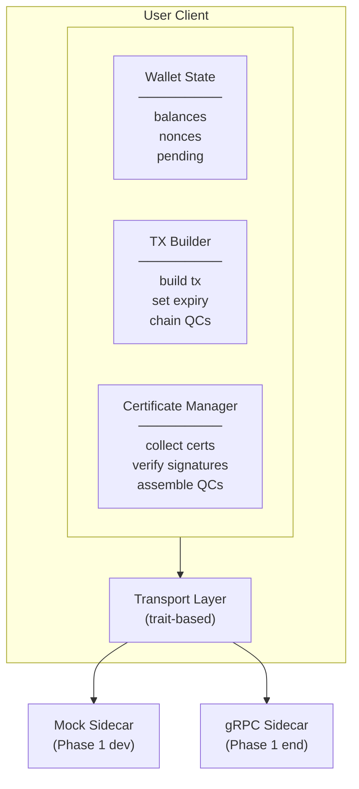

# FastPay User Client — Phase 1 Architecture & Implementation Plan

## Overview

This document covers the architecture and implementation plan for the FastPay user client in Phase 1. The client is responsible for:

- Constructing and submitting FastPay transactions to validator sidecars
- Collecting ValidatorCertificates and assembling QuorumCertificates
- Managing local state (balances, nonces, pending txs)
- Supporting chained payments (Bob spends funds received from Alice before block finalization)

**Constraints:**
- Partner's sidecar implementation won't be available until end of Phase 1 → mock the sidecar
- Code must compile to both native Rust and WASM (for Phase 2 browser support)
- Phase 2 will add: real sidecar integration, aggregator queries, UI integration

---

## Architecture

### High-Level Component Diagram



### Crate Structure

```
crates/
├── fastpay-types/           # Core traits and types (no dependencies on proto)
│   ├── src/
│   │   ├── lib.rs
│   │   ├── traits.rs        # Certificate, QuorumCert, Signer traits
│   │   ├── ids.rs           # Address, TxHash, NonceKey, etc.
│   │   └── error.rs         # CryptoError, AssemblyError, etc.
│   └── Cargo.toml
│
├── fastpay-crypto/          # Crypto implementations
│   ├── src/
│   │   ├── lib.rs
│   │   ├── ed25519.rs       # Ed25519Certificate, Ed25519Signer
│   │   ├── multi_cert_qc.rs # MultiCertQC (collection of certs)
│   │   ├── assembler.rs     # SimpleAssembler
│   │   └── hashing.rs       # tx_hash, effects_hash, qc_hash computation
│   └── Cargo.toml
│
├── fastpay-user-client/     # Main user client library
│   ├── src/
│   │   ├── lib.rs
│   │   ├── wallet.rs        # Wallet state management
│   │   ├── tx_builder.rs    # Transaction construction
│   │   ├── cert_manager.rs  # Certificate collection & QC assembly
│   │   ├── transport.rs     # Transport trait + implementations
│   │   └── config.rs        # Client configuration
│   └── Cargo.toml
│
├── fastpay-sidecar-mock/    # Mock sidecar for testing
│   ├── src/
│   │   ├── lib.rs
│   │   ├── mock_sidecar.rs  # In-memory mock implementation
│   │   └── scenarios.rs     # Pre-built test scenarios
│   └── Cargo.toml
│
└── fastpay-proto/           # Generated protobuf types + conversions
    ├── src/
    │   ├── lib.rs           # prost-generated types
    │   └── convert.rs       # Proto ↔ domain type conversions
    ├── build.rs
    └── Cargo.toml
```

**Dependency graph (layered):**
```
fastpay-types (traits, IDs, errors)
   ↑             ↑
   │             └── fastpay-proto (wire types + adapters at API boundaries)
   ├── fastpay-crypto (ed25519 impls, hashing)
   │
   ├── fastpay-user-client (wallet, tx builder, transport; may use proto adapters)
   │
   └── fastpay-sidecar-mock (mock validator logic)
```
`fastpay-proto` is an edge adapter crate. Core domain and crypto code should not depend on proto-generated types.

### Key Design Decisions

#### 1. Trait Interfaces for Protocol Objects (Upgrade Path)

Core protocol objects use trait interfaces to enable future upgrades (e.g., threshold signatures) without changing client logic:

```rust
/// A certificate from a single validator attesting to a transaction.
/// Demo: individual ed25519 signature
/// Future: could be a signature share in a threshold scheme
pub trait Certificate: Clone + Send + Sync {
    /// The transaction hash this certificate attests to
    fn tx_hash(&self) -> &TxHash;

    /// The effects hash this certificate attests to
    fn effects_hash(&self) -> &EffectsHash;

    /// The validator who issued this certificate
    fn signer(&self) -> &ValidatorId;

    /// Verify signature and signer membership against verification context.
    fn verify(&self, ctx: &VerificationContext) -> Result<(), CryptoError>;

    /// Raw signature bytes (for QC aggregation)
    fn signature_bytes(&self) -> &[u8];

    /// When the certificate was created
    fn created_at(&self) -> u64;
}

/// A quorum certificate proving threshold agreement on a transaction.
/// Demo: collection of individual validator certificates
/// Future: could be an aggregated threshold signature (BLS, FROST, etc.)
pub trait QuorumCert: Clone + Send + Sync {
    type Cert: Certificate;

    /// The transaction hash this QC attests to
    fn tx_hash(&self) -> &TxHash;

    /// The effects hash this QC attests to
    fn effects_hash(&self) -> &EffectsHash;

    /// The threshold required for this QC
    fn threshold(&self) -> u32;

    /// Number of certificates/shares in this QC
    fn cert_count(&self) -> usize;

    /// Check if QC meets threshold
    fn is_complete(&self) -> bool {
        self.cert_count() >= self.threshold() as usize
    }

    /// Verify the entire QC (all signatures or aggregated signature)
    /// and enforce committee membership + epoch consistency.
    fn verify(&self, ctx: &VerificationContext) -> Result<(), CryptoError>;

    /// Canonical hash of this QC (for use as parent_qc_hash)
    fn qc_hash(&self) -> QcHash;

    /// Access individual certificates (for multi-sig style QCs)
    fn certificates(&self) -> &[Self::Cert];
}

/// Trait for assembling a QC from individual certificates.
/// Demo: just collects certs until threshold met
/// Future: could perform signature aggregation
pub trait QuorumAssembler {
    type Cert: Certificate;
    type QC: QuorumCert<Cert = Self::Cert>;

    /// Create a new assembler for a given tx_hash and threshold
    fn new(tx_hash: TxHash, effects_hash: EffectsHash, threshold: u32) -> Self;

    /// Add a certificate to the assembler
    fn add_certificate(&mut self, cert: Self::Cert) -> Result<(), AssemblyError>;

    /// Check if we have enough certificates to form a QC
    fn is_complete(&self) -> bool;

    /// Attempt to finalize the QC (fails if threshold not met)
    fn finalize(self) -> Result<Self::QC, AssemblyError>;
}

/// Signature context to ensure strong domain separation.
pub struct CertSigningContext {
    pub chain_id: ChainId,
    pub domain_tag: &'static str,   // e.g. "tempo.fastpay.cert.v1"
    pub protocol_version: u16,
    pub epoch: u64,                 // binds signature to validator set epoch
}

/// Verification context for cert/QC validation.
pub struct VerificationContext {
    pub chain_id: ChainId,
    pub domain_tag: &'static str,
    pub protocol_version: u16,
    pub epoch: u64,
    pub committee: HashMap<ValidatorId, [u8; 32]>,
}

/// Trait for signing transactions (used by mock sidecar, potentially by client for demos)
pub trait Signer {
    type Cert: Certificate;

    /// Sign the canonical FastPay certificate message:
    /// H(domain_tag || protocol_version || chain_id || epoch || tx_hash || effects_hash)
    fn sign(
        &self,
        ctx: &CertSigningContext,
        tx_hash: &TxHash,
        effects_hash: &EffectsHash,
    ) -> Result<Self::Cert, CryptoError>;

    /// Get the validator identity for this signer
    fn validator_id(&self) -> &ValidatorId;
}
```

**Demo Implementations:**
- `Ed25519Certificate` — implements `Certificate` with ed25519 signature
- `MultiCertQC` — implements `QuorumCert` as a collection of individual certs
- `SimpleAssembler` — implements `QuorumAssembler` by collecting certs
- `Ed25519Signer` — implements `Signer` for mock sidecar

**Future Upgrade Path:**
- `ThresholdCertShare` — a share of a threshold signature
- `AggregatedQC` — a single aggregated BLS/FROST signature
- `ThresholdAssembler` — aggregates shares into a single signature

This design keeps the client logic (wallet, tx builder, cert manager) agnostic to the signature scheme.

#### 2. Transport Abstraction (WASM Compatibility)

The transport layer is trait-based to support multiple backends:

```rust
#[async_trait(?Send)]  // ?Send for WASM compatibility
pub trait SidecarTransport {
    async fn submit_fastpay(
        &self,
        request: SubmitFastPayRequest,
        meta: RequestMeta,
    ) -> Result<SubmitFastPayResponse, TransportError>;

    async fn get_bulletin_board(
        &self,
        request: GetBulletinBoardRequest,
    ) -> Result<GetBulletinBoardResponse, TransportError>;

    async fn get_validator_info(&self) -> Result<GetValidatorInfoResponse, TransportError>;

    async fn get_chain_head(&self) -> Result<GetChainHeadResponse, TransportError>;
}

pub struct RequestMeta {
    pub client_request_id: String, // idempotency key
    pub timeout_ms: u64,           // per-request budget
    pub max_retries: u32,
}
```

Implementations:
- `MockTransport` — in-memory mock for Phase 1 development
- `GrpcTransport` — real gRPC client (native only, Phase 1 integration)
- `GrpcWebTransport` — grpc-web for WASM (Phase 2)

Transport reliability policy:

- retries are safe only with a stable `client_request_id`
- use exponential backoff + jitter for transient errors
- stop retries when timeout budget is exhausted
- duplicate responses reconcile into a single local pending transaction record

#### 3. Async Runtime Abstraction

For WASM compatibility, avoid direct tokio dependencies in core client code:

```rust
// In Cargo.toml, use feature flags:
[features]
default = ["native"]
native = ["tokio"]
wasm = ["wasm-bindgen-futures"]
```

#### 4. Crypto Library Selection

Use `ed25519-dalek` with `getrandom` configured for WASM:

```rust
// Cargo.toml
ed25519-dalek = { version = "2", features = ["rand_core"] }
getrandom = { version = "0.2", features = ["js"] }  # for WASM
```

#### 5. Canonical Hashing and Encoding Rules

All hashes must be computed from canonical byte encoding, not in-memory struct layout:

- `tx_hash`: sha256 over canonical encoding of `chain_id, tempo_tx bytes, nonce_key, nonce_seq, expiry kind/value, parent_qc_hash`
- `effects_hash`: sha256 over canonical encoding of `sender, recipient, amount, asset, nonce advancement`
- `qc_hash`: sha256 over canonical encoding of `tx_hash, effects_hash, threshold, sorted cert list`

Canonicalization rules:

- integer fields use fixed-width big-endian encoding
- optional fields are encoded with explicit presence tags
- cert list is sorted by stable validator ID bytes before hashing
- hash preimages must never depend on map iteration order

Testing requirement:

- golden vectors must pass in both native Rust and WASM builds
- include cross-language vectors (for example, a TypeScript harness)

#### 6. State Management

Wallet state is generic over the certificate/QC types and serializable (for potential persistence):

```rust
pub struct WalletState<C: Certificate, Q: QuorumCert<Cert = C>> {
    /// Our identity
    pub address: Address,

    /// Known balances (base + overlay adjustments)
    pub balances: HashMap<AssetId, u64>,

    /// Next nonce sequence per nonce_key
    pub nonce_sequences: HashMap<NonceKey, u64>,

    /// Reserved nonces for in-flight submissions (prevents concurrent duplicate nonce use)
    pub reserved_nonces: HashSet<(NonceKey, u64)>,

    /// Pending outgoing transactions (awaiting QC)
    pub pending_txs: HashMap<TxHash, PendingTx>,

    /// Received certificates (for bulletin board sync)
    pub received_certs: HashMap<TxHash, Vec<C>>,

    /// Assembled QCs we can use as parents
    pub qcs: HashMap<TxHash, Q>,

    /// Bounded cache settings to prevent unbounded memory growth.
    pub cache_limits: CacheLimits,

    /// Append-only journal for crash recovery (nonce reservations, submits, QC assembly).
    pub journal: Vec<StateEvent>,
}

pub struct CacheLimits {
    pub max_pending_txs: usize,
    pub max_cached_certs: usize,
    pub max_cached_qcs: usize,
}

impl<C: Certificate, Q: QuorumCert<Cert = C>> WalletState<C, Q> {
    /// Atomically reserve the next nonce for a given key.
    pub fn reserve_next_nonce(&mut self, key: NonceKey) -> u64 {
        let next = self.nonce_sequences.entry(key).or_insert(0);
        let seq = *next;
        *next += 1;
        self.reserved_nonces.insert((key, seq));
        seq
    }

    /// Release a reservation on terminal failure (e.g. all validators reject).
    pub fn release_reserved_nonce(&mut self, key: NonceKey, seq: u64) {
        self.reserved_nonces.remove(&(key, seq));
    }

    /// Prune caches with deterministic policy (oldest first), preserving in-flight txs.
    pub fn prune_caches(&mut self) {
        // enforce cache_limits across pending_txs/received_certs/qcs
    }

    /// Recover from durable snapshot and replay journal events.
    pub fn recover_from_snapshot_and_journal(
        &mut self,
        snapshot: WalletSnapshot,
        events: &[StateEvent],
    ) {
        // apply snapshot, replay deterministic events, restore reservations
    }
}

// Type alias for demo implementation
pub type DemoWalletState = WalletState<Ed25519Certificate, MultiCertQC>;
```

State reconciliation loop:

- poll chain head and inclusion status
- mark pending txs as settled when inclusion/finality criteria are met
- prune settled entries and related cert/QC cache entries by policy
- keep journal checkpoints so restart does not reuse already-reserved nonces

---

## Mock Sidecar Design

Since the real sidecar won't be available until Phase 1 ends, we need a mock that:

1. **Simulates validator behavior** — accepts valid txs, rejects invalid ones
2. **Maintains state** — tracks balances, nonces, signed txs (equivocation guard)
3. **Issues certificates** — signs with a test validator key
4. **Supports the demo scenario** — Alice→Bob→Carol chain

### Mock Sidecar State

The mock sidecar is generic over signer and QC types (no trait-object storage for `QuorumCert`, which avoids object-safety issues):

```rust
pub struct MockSidecar<S: Signer, Q: QuorumCert<Cert = S::Cert>> {
    /// Signer for issuing certificates (uses trait interface)
    signer: S,

    /// Simulated base balances
    pub balances: HashMap<Address, HashMap<AssetId, u64>>,

    /// FastPay overlay (pending debits/credits)
    pub overlay: HashMap<Address, HashMap<AssetId, i64>>,

    /// Equivocation guard: (sender, nonce_key, nonce_seq) -> tx_hash
    pub signed_txs: HashMap<(Address, NonceKey, u64), TxHash>,

    /// Certificate store (multiple validators can attest to the same tx)
    pub certs: HashMap<TxHash, Vec<S::Cert>>,

    /// Known QCs (for validating parent_qc references)
    pub known_qcs: HashMap<QcHash, Q>,
}

// Type alias for demo implementation
pub type DemoMockSidecar = MockSidecar<Ed25519Signer, MultiCertQC>;
```

### Mock Validation Logic

```rust
impl<S: Signer, Q: QuorumCert<Cert = S::Cert>> MockSidecar<S, Q> {
    pub fn validate_and_sign(&mut self, req: SubmitFastPayRequest)
        -> Result<ValidatorCertificate, RejectReason>
    {
        let tx = &req.tx;

        // 0. Canonical validation must come from tempo_tx bytes.
        // `intent` is a UI/indexing hint and must match decoded payload if present.
        let decoded = self.decode_payment_from_tempo_tx(&tx.tempo_tx)?;
        if let Some(intent) = &tx.intent {
            if !self.intent_matches_decoded(intent, &decoded) {
                return Err(RejectReason::invalid_format("intent does not match tempo_tx"));
            }
        }
        let sender = decoded.sender;

        // 1. Check expiry
        if self.is_expired(&tx.expiry) {
            return Err(RejectReason::expired());
        }

        // 2. Check equivocation
        let contention_key = (sender, tx.nonce.key, tx.nonce.seq);
        if let Some(existing) = self.signed_txs.get(&contention_key) {
            if *existing != tx.hash() {
                return Err(RejectReason::equivocation());
            }
        }

        // 3. Check balance (base + overlay + parent QC credits)
        let available = self.available_balance(&sender, &decoded.asset, &req.parent_qcs)?;
        if available < decoded.amount {
            return Err(RejectReason::insufficient_funds());
        }

        // 4. Sign and store
        let cert = self.sign_certificate(&tx);
        self.signed_txs.insert(contention_key, tx.hash());
        self.store_cert_dedup_by_signer(tx.hash(), cert.clone());
        self.apply_overlay(&tx);

        Ok(cert)
    }
}
```

`store_cert_dedup_by_signer` appends only if no cert from that validator already exists for the same `tx_hash`.

---

## Demo Scenario Implementation

The Phase 1 demo involves:

| Actor | Starting Balance | Action |
|-------|-----------------|--------|
| Alice | $15 | Pays Bob $10 |
| Bob | $5 | Receives $10 from Alice, pays Carol $10 |
| Carol | $5 | Receives $10 from Bob |

### Sequence

```rust
// 1. Setup mock sidecars (Dave & Edgar)
let dave = MockSidecar::new("Dave", dave_key, initial_balances.clone());
let edgar = MockSidecar::new("Edgar", edgar_key, initial_balances.clone());

// 2. Alice creates and submits tx T1 (Alice → Bob, $10)
let alice_wallet = Wallet::new(alice_addr, /* ... */);
let t1 = alice_wallet.build_payment(bob_addr, 10, asset_id)?;
let cert_dave_t1 = dave.submit(t1.clone(), vec![])?;
let cert_edgar_t1 = edgar.submit(t1.clone(), vec![])?;

// 3. Bob fetches certs from bulletin board, assembles QC1
let bob_wallet = Wallet::new(bob_addr, /* ... */);
let qc1 = bob_wallet.assemble_qc(vec![cert_dave_t1, cert_edgar_t1])?;

// 4. Bob creates tx T2 (Bob → Carol, $10) with parent QC1
let t2 = bob_wallet.build_payment_with_parent(carol_addr, 10, asset_id, qc1.clone())?;
let cert_dave_t2 = dave.submit(t2.clone(), vec![qc1.clone()])?;
let cert_edgar_t2 = edgar.submit(t2.clone(), vec![qc1])?;

// 5. Carol fetches certs, assembles QC2, confirms receipt
let carol_wallet = Wallet::new(carol_addr, /* ... */);
let qc2 = carol_wallet.assemble_qc(vec![cert_dave_t2, cert_edgar_t2])?;
assert!(qc2.is_valid());
println!("Carol received QC-cleared payment!");
```

---

## Dependencies

### Core Dependencies

```toml
[dependencies]
# Async
async-trait = "0.1"
futures = "0.3"

# Serialization
prost = "0.13"
prost-types = "0.13"
bytes = "1"

# Crypto
ed25519-dalek = { version = "2", features = ["rand_core"] }
sha2 = "0.10"
rand = "0.8"

# Utils
thiserror = "1"
tracing = "0.1"

[target.'cfg(not(target_arch = "wasm32"))'.dependencies]
tokio = { version = "1", features = ["rt-multi-thread", "macros"] }
tonic = "0.12"

[target.'cfg(target_arch = "wasm32")'.dependencies]
wasm-bindgen = "0.2"
wasm-bindgen-futures = "0.4"
getrandom = { version = "0.2", features = ["js"] }

[build-dependencies]
prost-build = "0.13"
tonic-build = "0.12"
```

---

## Phase 2 Considerations (Not Implemented Yet)

For a smooth Phase 2 transition, the architecture anticipates:

1. **Real gRPC Transport** — `GrpcTransport` impl using tonic (native) and grpc-web (WASM)
2. **Aggregator Integration** — new `AggregatorTransport` for Phase 2 service queries
3. **UI Bindings** — WASM exports for JavaScript interop
4. **Persistent State** — localStorage or IndexedDB for wallet state in browser
5. **Real Tempo Transactions** — populate `TempoTxBytes` with actual RLP-encoded txs
6. **Committee/Epoch Source** — pull active validator set + epoch from chain/sidecars
7. **Transport Observability** — expose retry/idempotency metrics and error classes

The trait-based design enables two key upgrade paths:

**Transport Upgrade:** Swap `MockTransport` → `GrpcTransport` without changing client logic.

**Signature Scheme Upgrade (Future):** Swap demo multi-cert QCs → threshold signatures:

```rust
// Demo (Phase 1): collection of individual ed25519 signatures
type DemoQC = MultiCertQC<Ed25519Certificate>;

// Production (Future): single aggregated BLS signature
type ProductionQC = AggregatedBlsQC;

// Client code is generic and works with either:
impl<T, C, Q> FastPayClient<T, C, Q>
where
    T: SidecarTransport,
    C: Certificate,
    Q: QuorumCert<Cert = C>,
{ /* ... */ }
```

This allows starting simple (multi-sig) and upgrading to threshold crypto later without rewriting client logic.

---

## Design Decisions

1. **Nonce key strategy**: Single hardcoded FastPay nonce key for demo. The nonce key should be defined as a constant but abstracted behind a trait or configuration interface so it can be made configurable for production without changing client logic.

2. **Certificate caching**: Cache certificates until the underlying FastPay transaction settles on-chain (included in a block). Even though Phase 1 won't have the sidecar wired to the Tempo node, the architecture anticipates a reconciliation loop driven by chain head/inclusion status.

3. **Concurrent submissions**: Submit to all validators in parallel using async join. This minimizes latency for QC assembly.

4. **Error recovery**: Proceed only if QC threshold remains achievable. For the Phase 1 demo (`n=2`, `threshold=2`), any rejection is terminal for that tx and should be surfaced as a hard failure.

5. **Bounded memory**: Pending txs, cert cache, and QC cache must be size-bounded with deterministic pruning to avoid unbounded growth during long-running sessions.

6. **Crash recovery**: Nonce reservations, submit outcomes, and QC assembly events must be journaled and recoverable from snapshot + replay so restarts do not double-spend nonce space.

7. **Committee-bound verification**: Cert and QC verification must be bound to `(chain_id, domain, protocol_version, epoch, committee)`; unknown signers and mixed-epoch certs are rejected.
